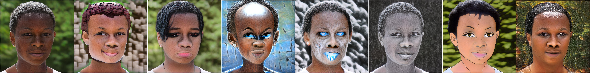
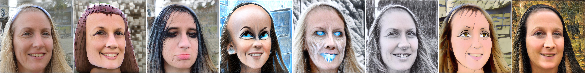
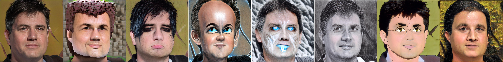
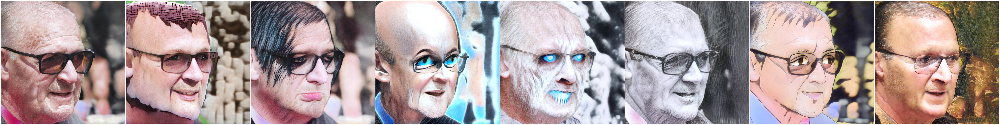
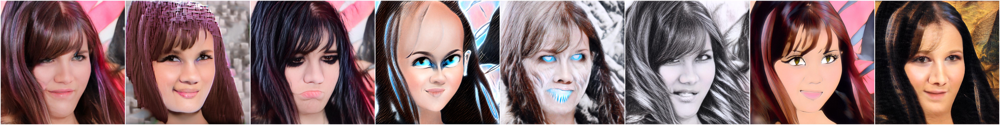
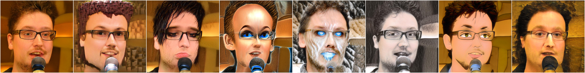
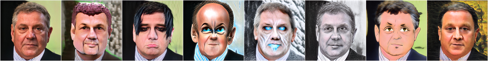
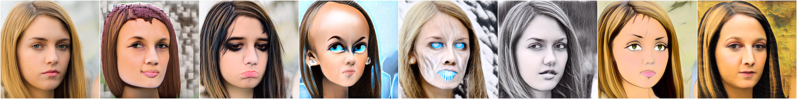
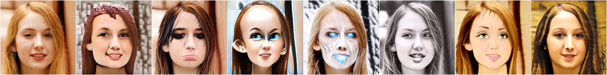

# StyleGAN-NADA-reimplementation-for-DLS-School
В данном репозитории представлена кастомная реализация алгоритма StyleGAN-NADA (Non-Adversarial Domain Adaptation). Метод позволяет адаптировать предобученный генератор StyleGAN под новые стили без использования целевых изображений. Направление изменения стиля кодируется и контролируется с помощью модели CLIP

Для облегчения репозитория все обученные веса моделей вынесены на внешнюю платформу:
* **Базовая модель:** StyleGAN2-FFHQ (Config-F) от Rosinality.
* **Оптимизированные веса стилей:** Доступны в репозитории [Hugging Face Hub (Sopfop/stylegan2-nada-weights)](https://huggingface.co).

