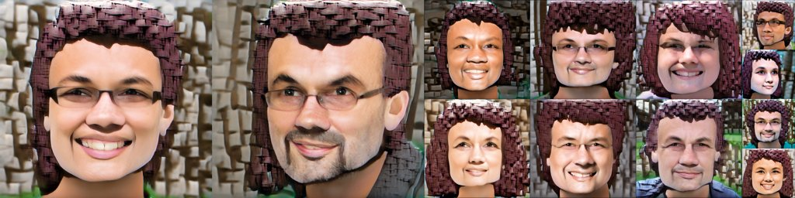
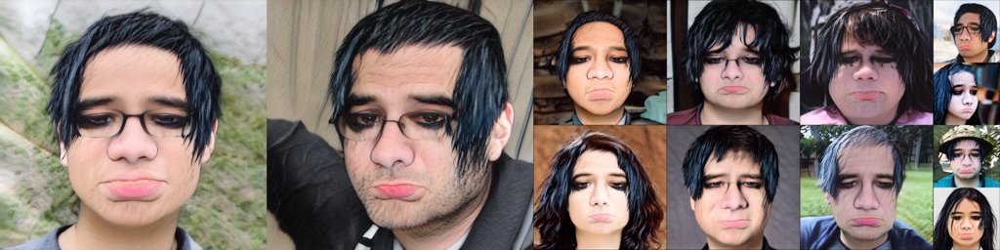
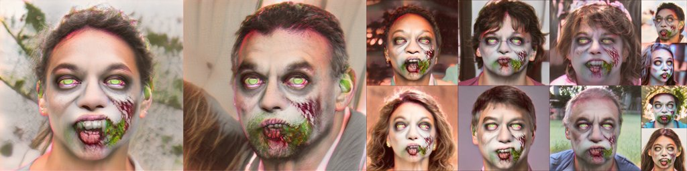
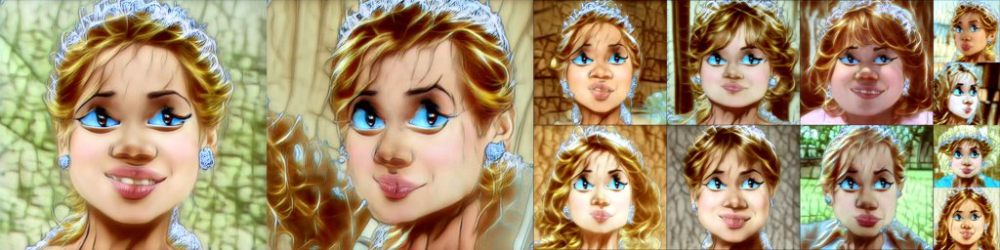
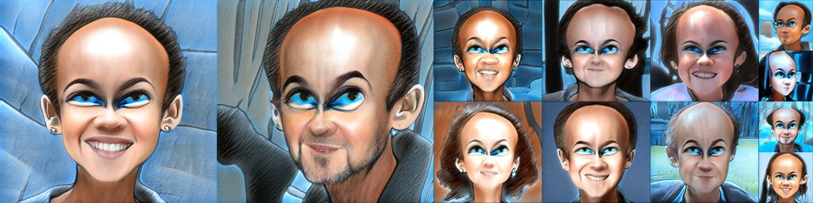
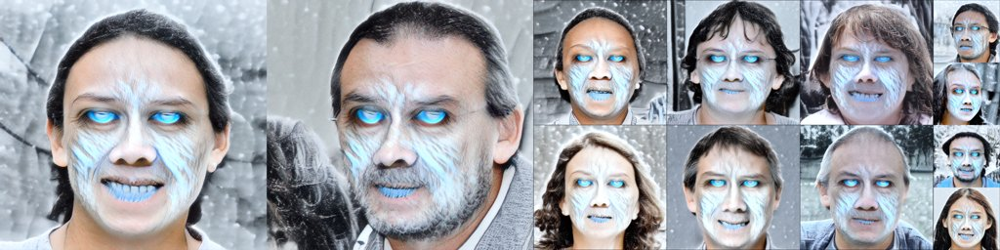
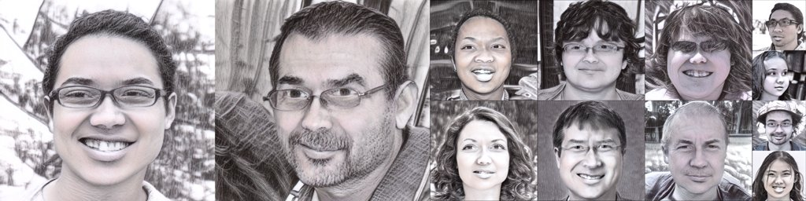
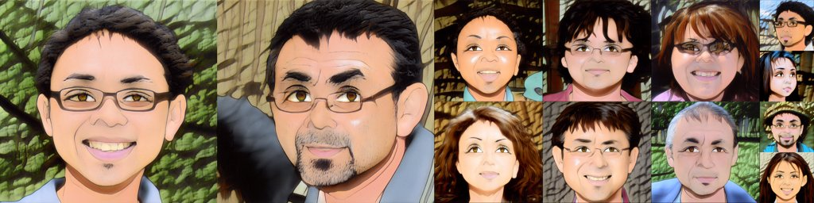
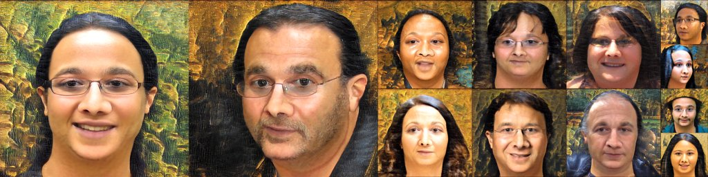

# StyleGAN-NADA-reimplementation-for-DLS-School
В данном репозитории представлена кастомная реализация алгоритма StyleGAN-NADA (Non-Adversarial Domain Adaptation). Метод позволяет адаптировать предобученный генератор StyleGAN под новые стили без использования целевых изображений. Направление изменения стиля кодируется и контролируется с помощью модели CLIP.

Основная задача работы — построить пайплайн обучения генератора StyleGAN2 под различные целевые стили без использования обучающего датасета с изображениями. 

### Что реализовано в проекте:
* **Directional CLIP Loss** — направленная функция потерь (с возможностью подключения одной или двух моделей CLIP одновременно);
* **Иерархический отбор слоев** — алгоритм автоматического выбора $k$ наиболее чувствительных слоев генератора на основе изменений в пространстве $W+$;
* **Пайплайн обучения** — скрипты для обучения и инференса модели, проведения экспериментов с гиперпараметрами и наглядной визуализации полученных результатов.

### Структура репозитория:
В папке `models` находятся jupyter-ноутбуки для работы с моделью:
* `train` — позволяет запустить обучение генератора под заданный стиль и протестировать экспериментальные гипотезы;
* `inference` — предназначен для автоматической загрузки весов с Hugging Face Hub и генерации изображений в разных стилях.
* `inference` — содержит подробный отчёт с поставновкой проблемы, описанием решение и эксперементов.

Все обученные веса моделей вынесены на Hugging Face:
* **Базовая модель:** StyleGAN2-FFHQ от Rosinality.
* **Оптимизированные веса стилей:** Доступны в репозитории [Hugging Face Hub (F34723/stylegan2-nada-weights)](https://huggingface.co/F34723/stylegan2-nada-weights).

<b>Minecraft</b>

 

<b>Emo</b>

 

<b>Zombie</b>

 

<b>Cinderella</b>

 

<b>Megamind</b>

 

<b>Whitewalker</b>

 

<b>Sketch</b>

 

<b>Anime</b>

 

<b>Monalisa</b>

 

